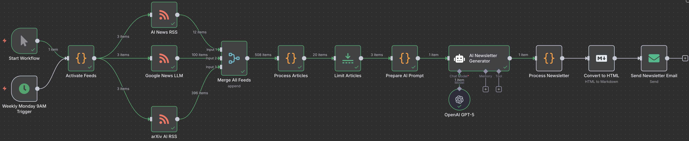
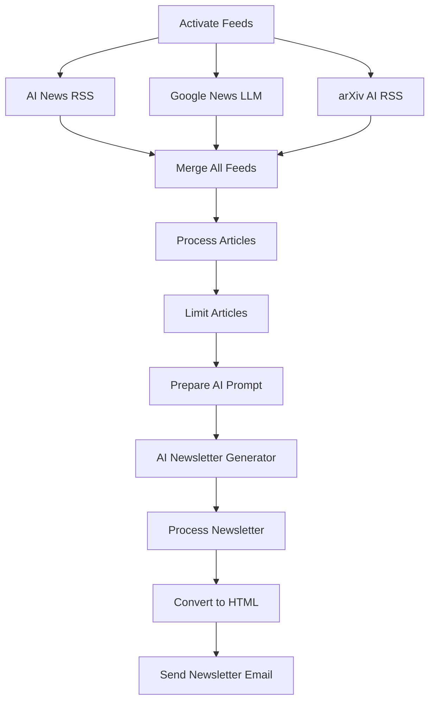

# 🤖 AI Newsletter - Automated Weekly Digest

> **AI news, by AI. A weekly automated digest built with n8n to keep you in the loop.**

[](https://n8n.io/)
[](https://openai.com/)
[](https://github.com)

---

## 🚀 Overview

This is an **automated n8n workflow** that delivers a comprehensive AI newsletter directly to your inbox every **Monday at 9 AM**. The system intelligently aggregates content from reliable RSS sources, processes it through AI, and delivers the most relevant and up-to-date AI news in a beautifully formatted weekly digest.


*Complete n8n workflow showing the automated AI newsletter pipeline*

### ✨ Key Features

- **🕘 Automated Scheduling**: Runs every Monday at 9 AM automatically
- **📰 Multi-Source Aggregation**: Pulls from 3+ premium AI news sources
- **🧠 AI-Powered Summarization**: Uses GPT-5 to create intelligent summaries
- **📧 Professional Email Delivery**: Clean, formatted newsletters sent directly to your inbox
- **🔍 Smart Content Curation**: Removes duplicates and prioritizes the most relevant content
- **📊 Rich Metadata**: Includes word counts, article statistics, and publication dates

---

## 🏗️ Architecture

The workflow follows a sophisticated data pipeline:



### 📋 Data Sources

1. **AI News RSS** - `artificialintelligence-news.com`
2. **Google News LLM** - Curated LLM news from Google News
3. **arXiv AI RSS** - Latest AI research papers from arXiv

---

## 🛠️ Setup Instructions

### Prerequisites

- n8n instance (self-hosted or cloud)
- OpenAI API key with GPT-5 access
- SMTP email credentials

### Installation

1. **Import the Workflow**
   ```bash
   # Download the workflow.json file
   # Import into your n8n instance via the UI
   ```

2. **Configure Credentials**
   - **OpenAI API**: Add your OpenAI API key
   - **SMTP**: Configure your email service credentials

3. **Customize Email Settings**
   - Update sender email in the "Send Newsletter Email" node
   - Modify recipient email address
   - Adjust email subject template if needed

4. **Activate the Workflow**
   - Enable the workflow in n8n
   - Set up the cron trigger for Monday 9 AM execution

---

## 📊 Newsletter Structure

Each weekly newsletter includes:

### 📈 **Executive Summary**
- 2-3 sentences highlighting the most important AI developments

### 🔥 **Key Developments**
- 3-4 major stories with detailed explanations and source links

### 🔬 **Research & Innovation**
- Notable research papers, new models, and technical advances

### 🏢 **Industry News**
- Business updates, partnerships, funding rounds, and market movements

### ⚡ **Quick Summaries**
- Additional interesting developments in digestible bullet points

---

## 🎯 Technical Specifications

- **Processing**: Handles up to 20 articles per run, limited to top 3 for newsletter
- **AI Model**: OpenAI GPT-5 for intelligent content summarization
- **Output Format**: Markdown with HTML conversion for email compatibility
- **Content Length**: 800-1000 words per newsletter
- **Deduplication**: Smart URL-based duplicate removal
- **Sorting**: Chronological ordering by publication date

---

## 🔧 Customization Options

### Adding New RSS Sources
1. Add new RSS Feed Read nodes
2. Connect to the "Merge All Feeds" node
3. Update the merge node's input count

### Modifying AI Prompts
- Edit the "Prepare AI Prompt" node to change newsletter structure
- Adjust tone, length, or focus areas

### Email Formatting
- Modify the "Process Newsletter" node for different HTML styling
- Update email templates in the "Send Newsletter Email" node

---

## 📈 Performance & Monitoring

The workflow includes built-in monitoring:
- Article count tracking
- Word count statistics
- Generation timestamps
- Source attribution
- Error handling for failed RSS feeds

---

## 🤝 Contributing

This project was built for an AI hackathon and welcomes contributions:

1. Fork the repository
2. Create a feature branch
3. Make your improvements
4. Submit a pull request

---

## 📄 License

This project is open source and available under the [MIT License](LICENSE).

---

## 🏆 Hackathon Project

**Built for AI Hackathon 2025**

This automated newsletter system demonstrates the power of combining:
- **Workflow Automation** (n8n)
- **AI Intelligence** (OpenAI GPT-5)
- **Data Processing** (RSS aggregation)
- **Email Delivery** (SMTP integration)

Perfect for staying updated with the rapidly evolving AI landscape without manual effort!

---

<div align="center">

**⭐ Star this repo if you find it useful!**

*Keep up with AI news, automatically.* 🚀

</div>
